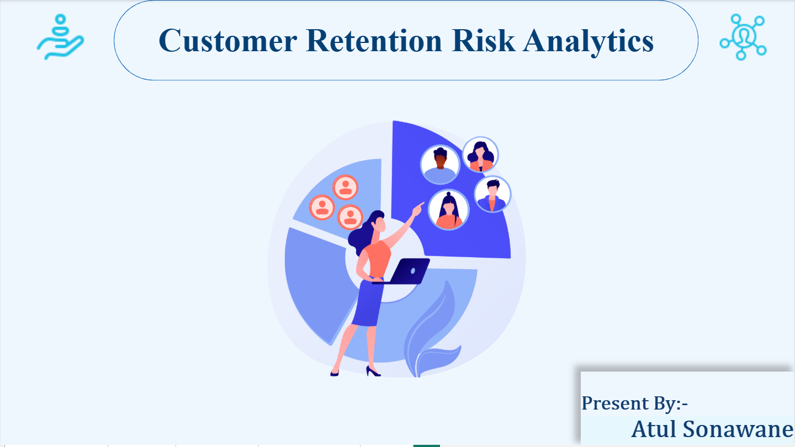
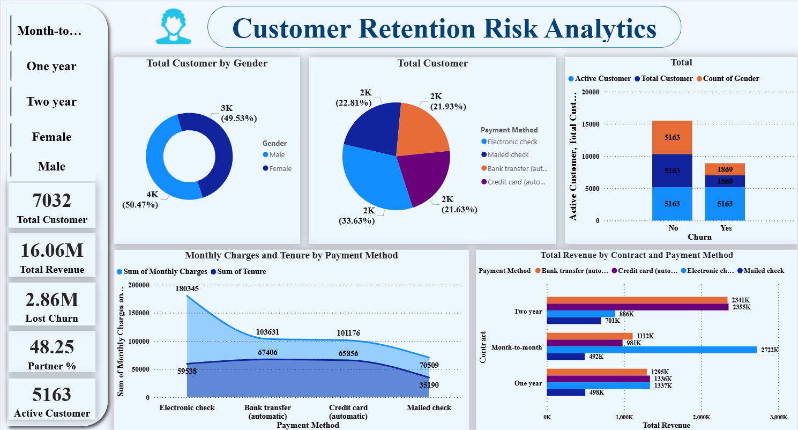
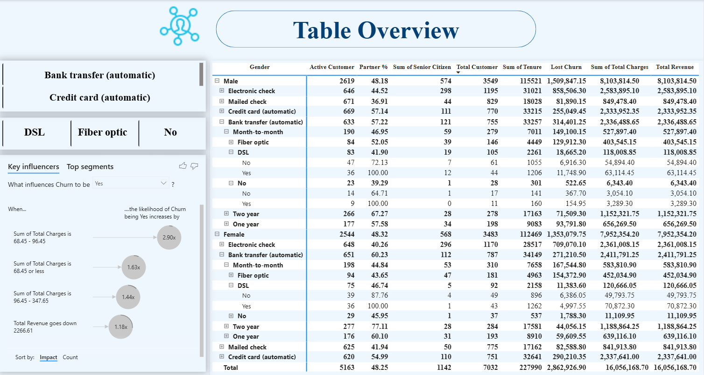
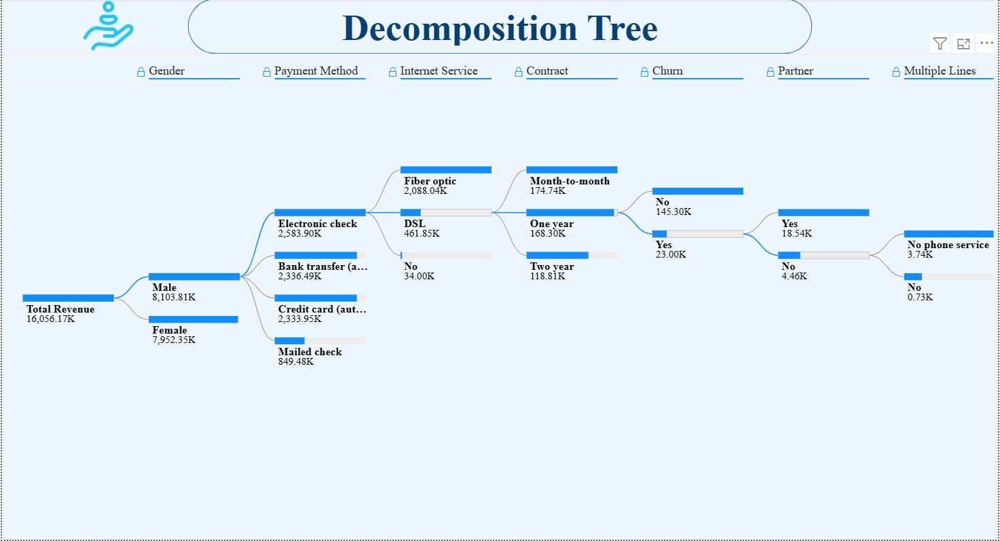

📊 Customer Retention Risk Analytics Dashboard
📝 Project Overview
This project presents an interactive Customer Retention Risk Analytics Dashboard developed using Power BI to analyze customer churn behavior and identify factors influencing customer retention.
The dashboard analyzes telecom customer data to understand patterns in customer tenure, payment methods, contract types, internet services, and revenue contributions.
The main objective of this project is to help businesses identify churn risks and improve customer retention strategies using data-driven insights.

🎥 Dashboard Demo Video
[▶ Watch Dashboard Demo](recording.mp4)

📷 Dashboard Preview
Customer Retention

Customer Churn Analysis

Table Overview

Decomposition Tree Analysis

🚀 Key Metrics
Metric	Value
Total Customers	7032
Active Customers	5163
Churn Customers	1869
Total Revenue	$16.06M
Lost Revenue	$2.86M

🛠 Tech Stack
Customer Retention Risk Analytics Dashboard built using Power BI to analyze telecom customer churn and retention trends.
Data Visualization
Power BI 
Data Processing
Excel
Data Analysis
SQL
Data Transformation
Power Query

⚙️ Project Methodology
1️⃣ Data Collection
The dataset includes telecom customer data such as:
Customer demographics
Contract types
Payment methods
Internet services
Monthly charges
Customer tenure
Churn status

2️⃣ Data Cleaning
Removed missing values
Standardized column names
Handled inconsistent categorical data

3️⃣ Data Transformation
Created calculated measures and KPIs:
Total Customers
Active Customers
Churn Customers
Total Revenue
Lost Revenue
Partner Percentage

4️⃣ Dashboard Development
Built an interactive Power BI dashboard including:
KPI cards
Interactive slicers
Revenue analysis
Customer segmentation
Decomposition tree analysis

🔍 Key Insights
Contract Type Impact
Customers with month-to-month contracts show the highest churn probability.
Payment Method Behavior
Customers using Electronic Check payment methods have higher churn rates.
Internet Service Analysis
Fiber optic service contributes the highest revenue but also shows churn patterns.
Customer Retention
Customers with long-term contracts and automatic payments show better retention.

## Also Visit our related Repo..Details Overview

### https://github.com/atulmali2510/customer-retention-risk-analytics-with-SQL
### https://github.com/atulmali2510/customer-retention-risk-analytics-with-Excel 

